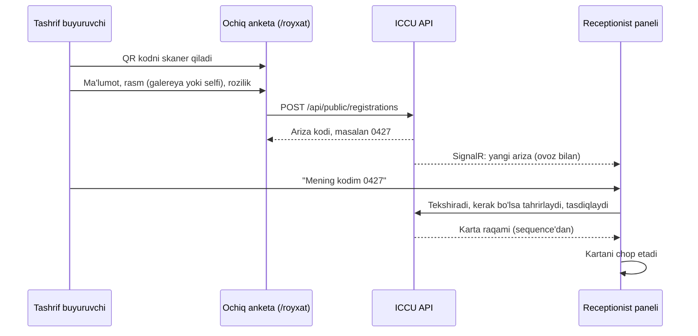
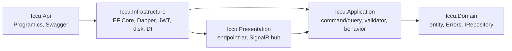

# ICCU Access Card — loyihaning umumiy ko'rinishi

O'zbekiston Islom sivilizatsiyasi markazi kutubxonasi uchun kitobxonlarni ro'yxatga olish va kirish kartasini chop etish tizimi.

| | |
|---|---|
| Buyurtmachi | O'zbekiston Islom sivilizatsiyasi markazi kutubxonasi |
| Foydalanuvchilar | Receptionist va administratorlar (admin panel), tashrif buyuruvchilar (QR anketa) |
| Server | Markazning o'z serveri, Docker Swarm |
| Holat | Backend skeleti yozilmoqda (Domain qatlami tayyor) |
| Oxirgi yangilanish | 2026-09-26 |

---

## 1. Nima uchun yangi tizim

Eski sayt (`idcard-vert.vercel.app`) JavaScript kodi tahlil qilindi. U to'liq tizim emas, bitta brauzerda ishlaydigan demo ekan:

| Muammo | Kodda qanday yozilgan | Oqibati |
|---|---|---|
| Backend va baza yo'q | Barcha ma'lumot `localStorage["iccu-students"]`da | Har bir kompyuterning ro'yxati alohida, brauzer tozalansa hammasi yo'qoladi |
| Login yolg'on | `admin` / `12345` brauzerda tekshiriladi, keyin `localStorage`ga `iccu-admin-auth = true` yoziladi | Parol ochiq kodda turibdi, loginni konsoldan chetlab o'tish mumkin |
| Raqam "har kuni reset bo'ladi" | `max(id) + 1`, faqat shu brauzerdagi ro'yxat bo'yicha | Boshqa kompyuterda yoki tozalangan brauzerda raqamlash 0000001 dan qayta boshlanadi. O'chirilgan oxirgi raqam boshqa odamga qayta beriladi |
| Rasmlar | PNG base64 ko'rinishida `localStorage`da | Limit taxminan 5 MB, bir necha o'nlab rasmdan keyin saqlash jimgina ishlamay qoladi |
| Hosting | Vercel, AQSh | Shaxsga doir ma'lumotlar O'zbekiston hududida saqlanishi kerak |

Xulosa: eski kodni tuzatib bo'lmaydi, tizim noldan yoziladi.

---

## 2. Talablar

### 2.1 Kitobxon ma'lumotlari

| Maydon | Qoida |
|---|---|
| Toifa | O'quvchi, Talaba, Magistr, PhD, DSc, Professor, Xodim, Foydalanuvchi |
| Familiya, ism | Majburiy |
| Otasining ismi | Ixtiyoriy |
| Tug'ilgan sana | O'tgan sana, 1900-yildan keyin |
| Jinsi | Erkak yoki Ayol, majburiy |
| Fuqaroligi | O'zbekiston fuqarosi yoki Chet el fuqarosi, majburiy |
| Telefon | O'zbekiston fuqarosi uchun O'zbekiston raqami (`+998XXXXXXXXX`). Chet el fuqarosi uchun xalqaro raqam ham mumkin (8–15 raqam, `+79012345678` ko'rinishida saqlanadi) |
| Rasm | Fayldan yoki kamera orqali. Frontend 3:4 nisbatda kesadi, server faylni o'zgartirmasdan saqlaydi |

### 2.2 Karta raqami

- 7 xonali: `0000001` dan `9999999` gacha, PostgreSQL `SEQUENCE` orqali beriladi.
- **Hech qachon reset bo'lmaydi va yilga bog'lanmaydi.** Yiliga 100 ming kitobxon kelsa ham 100 yilga yetadi.
- Raqam faqat kitobxon tasdiqlanganda beriladi. Rad etilgan arizalar raqamni band qilmaydi.
- O'chirish yumshoq (soft delete), shuning uchun raqam boshqa odamga qayta berilmaydi.
- Bitta telefon raqami bilan ikki marta ro'yxatdan o'tib bo'lmaydi (handler tekshiradi, `409 Reader.PhoneAlreadyRegistered`). Qayta kelgan kitobxonga yangi raqam ochilmaydi, eski kartasi qayta chop etiladi.
- Hujjat turi va hujjat raqami 2026-09-30 da ma'muriyat topshirig'i bilan butunlay olib tashlandi (yuridik sabab: kutubxona shaxsni tasdiqlovchi hujjat ma'lumotini saqlamasligi kerak). Ularning o'rniga jins va fuqarolik qo'shildi. Eski yozuvlarda jins va fuqarolik bo'sh (`NULL`), ular tahrirlanganda to'ldiriladi.

### 2.3 Karta

- O'lchami 85 × 55 mm, Canon printer (aniq modeli hali noma'lum).
- Amal qilish muddati hamma toifalar uchun **2 yil**: berilgan sana + 2 yil.
- Uzaytirishda raqam o'zgarmaydi, yangi muddat bilan karta qayta chop etiladi.
- Chop etishlar soni va oxirgi chop etilgan vaqt saqlanadi.

### 2.4 QR orqali o'zi ro'yxatdan o'tish

Bir vaqtda 20 kishi kelganda ikki receptionist ulgurmaydi. Shuning uchun stolga QR kod yopishtiriladi:



- Ariza 24 soat ichida ko'rib chiqilmasa avtomatik "muddati o'tgan" holatiga o'tadi.
- Ochiq anketaga spamdan himoya: IP bo'yicha limit (10 daqiqada 60 ta ariza va 120 ta rasm; kutubxona Wi-Fi'sida hamma bitta IP bilan chiqishi mumkin, shuning uchun limit baland).
- Ariza kodi 4 xonali, 9999 dan keyin qaytadan aylanadi. Faqat kutilayotgan arizalar orasida unique.

### 2.5 Admin panel funksiyalari

- **Kitobxonlar ro'yxati**: pagination, qidiruv (F.I.Sh., karta raqami, telefon), filtrlar (toifa, jins, fuqarolik, holat, manba, sana oralig'i), tahrirlash, o'chirish, kartani uzaytirish va chop etish.
- **Excelga eksport**: filtr qo'llangan to'liq ro'yxat, server tomonda tayyorlanadi.
- **Arizalar navbati**: real vaqtda yangilanadi, tasdiqlash yoki rad etish.
- **Dashboard**:
  - jami, faol va muddati o'tgan kitobxonlar soni;
  - bugun va shu oy ro'yxatdan o'tganlar;
  - kutilayotgan arizalar;
  - 30 kun ichida muddati tugaydiganlar;
  - toifalar, jins va fuqarolik bo'yicha taqsimot, oxirgi 30 kun grafigi.
- **Hisobotlar**: davr bo'yicha (kun yoki oy), toifa, jins, fuqarolik, manba (resepshn yoki QR) va foydalanuvchi kesimida.
- **Foydalanuvchilar boshqaruvi** (faqat admin): yaratish, rol berish, faolsizlantirish, parolni tiklash.

### 2.6 Rollar

| Amal | Receptionist | Admin |
|---|---|---|
| Kitobxon qo'shish, tahrirlash, chop etish, uzaytirish | Ha | Ha |
| Arizani tasdiqlash yoki rad etish | Ha | Ha |
| Dashboard va hisobotlar | Ha | Ha |
| Kitobxonni o'chirish | Yo'q | Ha |
| Excelga eksport (to'liq shaxsiy ma'lumot bilan) | Yo'q | Ha |
| Foydalanuvchilarni boshqarish | Yo'q | Ha |

---

## 3. Texnologiyalar

### 3.1 Backend

| Qatlam | Tanlov | Izoh |
|---|---|---|
| Platforma | .NET 10, C# 14, ASP.NET Core Minimal API | `tofan` bilan bir xil |
| CQRS | **MediatR** 12.5 (Apache 2.0) | `tofan` bilan bir xil. Handler'lar `internal`, DI faqat Infrastructure'da |
| Yozish | EF Core 10 + Npgsql, snake_case | Faqat yozish: repository + Unit of Work |
| O'qish | **Dapper** | Barcha ro'yxat, qidiruv, hisobot va dashboard so'rovlari |
| Validatsiya | FluentValidation, pipeline behavior orqali | Xatolar uz / ru / en tillarida |
| Baza | PostgreSQL 17+ | `SEQUENCE`, `pg_trgm` (xatoga chidamli qidiruv), partial unique index |
| Auth | **O'zimizning JWT** | Access token 15 daqiqa, refresh token HttpOnly cookie'da (rotatsiya bilan), PBKDF2 parol hash, 5 xato urinishdan keyin 15 daqiqa bloklash |
| Real-time | SignalR | Yangi ariza haqida receptionistlarga xabar |
| Excel | DocumentFormat.OpenXml | `tofan`dagi `ExcelWriter` ko'chiriladi |
| Fon vazifalar | Hangfire + Hangfire.PostgreSql | `tofan` bilan bir xil. Dashboard faqat Development'da |
| Loglar | Serilog | Strukturali log |
| API hujjati | Swashbuckle (Swagger UI) | `tofan` bilan bir xil |
| Sifat | SonarAnalyzer.CSharp, NetArchTest, xUnit | Kodda izoh yozilmaydi (`tofan` qoidasi) |

Litsenziya bo'yicha qarorlar:
- **FluentAssertions 8+** ishlatilmaydi, chunki u ham tijorat litsenziyasiga o'tgan. Testlarda xUnit `Assert` ishlatiladi.

### 3.2 Rasmlar qayerda saqlanadi: disk

Rasmlar **diskda** saqlanadi, bazada (`stored_files`) faqat ularning yozuvi turadi. Kitobxon va ariza rasmga `photo_file_id` orqali bog'lanadi. Sabablari:

- `tofan`da ham shunday: `Storage` moduli va `LocalDiskFileStore`, Swarm'da bind mount orqali.
- Swarm bitta node'da ishlaydi, shuning uchun umumiy volume muammosi yo'q.
- Baza kichik va tez qoladi, `pg_dump` yengil bo'ladi.
- Rasm oqim (stream) sifatida to'g'ridan-to'g'ri diskdan beriladi, bazaga yuk tushmaydi.
- `IFileStore` abstraksiyasi orqasida turadi. Kelajakda MinIO/S3'ga o'tish uchun faqat bitta klass almashtiriladi.

Diqqat: API konteyneriga `/var/iccu/files` mount qilinishi **majburiy**. Mount tushib qolsa, rasmlar konteyner ichiga yoziladi va keyingi deploy'da jimgina yo'qoladi. Backup: `pg_dump` va rasmlar papkasining `rsync` nusxasi.

### 3.3 Frontend (keyingi bosqich)

- React + Vite + TypeScript.
- Tailwind + shadcn/ui.
- TanStack Query va TanStack Table.
- React Hook Form + Zod.
- Recharts, react-easy-crop.

Bitta ilovada ikki zona bo'ladi:

| Zona | Kim uchun | Himoya |
|---|---|---|
| `/royxat` | Ochiq, mobilga moslangan anketa | Internetdan ochiq |
| `/admin` | Admin panel | Login + faqat kutubxona tarmog'idan (IP allowlist) |

Dizayn uchun Figma'da tayyor shablon bor, frontend bosqichida undan foydalaniladi.

---

## 4. Arxitektura

`tofan`dagi **modular** clean architecture emas, **oddiy clean architecture**: modullar yo'q, bitta to'plam qatlamlar. `tofan`ning `Common` qatlamidagi narsalar tegishli qatlamlarga taqsimlanadi.



```text
iccu-access-card/
  src/
    Iccu.Domain/           Common + entity papkalari (Readers, RegistrationRequests, Users, RefreshTokens): entity, Errors, IRepository
    Iccu.Application/      CQRS (MediatR), biznes mantiq handler'lar ichida, validator'lar, pipeline behavior'lar, Dapper so'rovlari
    Iccu.Infrastructure/   DbContext, migratsiyalar, repository'lar, JWT, ObjectStorage, Hangfire job'lar, barcha DI konfiguratsiyasi
    Iccu.Presentation/     endpoint'lar (IEndpoint), Requests/, ApiResults, SignalR hub
    Iccu.Api/              Program.cs, middleware, Swagger, CORS
  test/
    Iccu.ArchitectureTests/
    Iccu.UnitTests/
  docs/
  deploy/                  Swarm stack fayllari, nginx konfiguratsiyasi
```

### 4.1 `tofan`dan olingan qoidalar

- Yozish faqat EF Core orqali, o'qish faqat Dapper orqali.
- Command va uning handler'i bitta faylda turadi. Query ham shunday.
- Biznes natijalari exception bilan emas, `Result` / `Error` bilan qaytariladi. Xatolar domen qatlamidagi `XxxErrors` katalogida, entity yonida.
- Biznes qoidalari command/query handler'ining ichida yoziladi. `CardNumber`, `LoginPolicy` kabi alohida yordamchi klasslar ochilmaydi.
- Vaqt faqat `IDateTimeProvider` orqali olinadi. "Bugun" Asia/Tashkent vaqt zonasi bo'yicha hisoblanadi.
- Endpoint'lar yupqa bo'ladi: faqat mediator'ga uzatadi.
- Kodda izoh yozilmaydi. Sabablar commit xabari va `docs/`ga yoziladi.
- Arxitektura testlari qatlamlar orasidagi bog'lanishni, nomlashni va `sealed`/`internal` qoidalarini tekshiradi.

### 4.2 `tofan`dan farqlari

| `tofan` | ICCU |
|---|---|
| Modular monolith | Oddiy clean architecture |
| Keycloak | O'zimizning JWT auth |
| Angular + PrimeNG | React + shadcn/ui |
| Refresh token javob body'sida | Refresh token HttpOnly cookie'da |

---

## 5. Ma'lumotlar modeli

Barcha jadvallar `iccu` sxemasida.

| Jadval | Asosiy ustunlar | Indekslar |
|---|---|---|
| `readers` | `id` (Guid v7), `card_number` (sequence), toifa, F.I.Sh., `birth_date`, `gender` (null bo'lishi mumkin), `citizenship` (null bo'lishi mumkin), `phone`, `photo_file_id`, `source`, `issued_on`, `expires_on`, `print_count`, `created_at`, `created_by`, `updated_at`, `deleted_at` | `card_number` unique; `search_text` va `phone` bo'yicha trigram GIN (telefon takrori ham shu bilan tekshiriladi); `expires_on`, `created_at` |
| `registration_requests` | `id`, `code` (4 xonali, aylanuvchi sequence), `status`, shaxs maydonlari, `photo_file_id`, `submitted_at`, `expires_at`, `reviewed_*`, `rejection_reason`, `reader_id` | `code` unique (faqat Pending orasida); `status`, `submitted_at` |
| `users` | `id`, `username` (unique), `full_name`, `password_hash`, `role`, `is_active`, lockout maydonlari | `username` unique |
| `refresh_tokens` | `id`, `user_id`, `token_hash` (SHA-256), `expires_at`, `revoked_at` | `token_hash` unique |

Karta holati ("faol" yoki "muddati o'tgan") alohida saqlanmaydi, `expires_on` va bugungi sanadan hisoblanadi.

---

## 6. API rejasi

Tashqaridan barcha yo'llar `/api` ostida, nginx `/api`ni olib tashlab API'ga uzatadi (`tofan` kabi). Jadvaldagi yo'llar server ichidagi ko'rinishda.

| Guruh | Endpoint'lar | Ruxsat |
|---|---|---|
| Auth | `POST auth/login`, `POST auth/refresh`, `POST auth/logout`, `GET auth/me`, `POST auth/change-password` | login/refresh: anonim, rate limit bilan |
| Foydalanuvchilar | `GET users`, `POST users`, `PUT users/{id}`, `POST users/{id}/reset-password` | Admin |
| Kitobxonlar | `GET readers`, `GET readers/{id}`, `POST readers`, `PUT readers/{id}`, `POST readers/{id}/renew`, `POST readers/{id}/prints` | Foydalanuvchi (Receptionist yoki Admin) |
| | `DELETE readers/{id}`, `GET readers/export` | Admin |
| Fayllar | `POST files`, `GET files/{id}/content` | Foydalanuvchi (Receptionist yoki Admin) |
| | `DELETE files/{id}` | Admin |
| Ochiq anketa | `POST public/files`, `POST public/registrations` | Anonim, rate limit bilan |
| Arizalar | `GET registration-requests`, `GET registration-requests/{id}`, `PUT .../{id}`, `POST .../{id}/approve`, `POST .../{id}/reject` | Foydalanuvchi (Receptionist yoki Admin) |
| Dashboard va hisobot | `GET dashboard`, `GET reports/registrations?from&to&groupBy` | Foydalanuvchi (Receptionist yoki Admin) |
| Real-time | `hubs/registrations` (SignalR) | Foydalanuvchi (Receptionist yoki Admin) |
| Holat | `/health` | Ochiq |

---

## 7. Xavfsizlik

- Parollar PBKDF2 bilan hash qilinadi (ASP.NET `PasswordHasher`). Login'da foydalanuvchi mavjud bo'lmasa ham hash tekshiriladi, shunda javob vaqtidan login borligini bilib bo'lmaydi.
- Refresh token faqat HttpOnly + Secure + SameSite=Strict cookie'da turadi. Bazada uning faqat SHA-256 hash'i saqlanadi. Har yangilanishda rotatsiya qilinadi.
- JWT imzolash kaliti va baza paroli serverdagi `/opt/iccu/env/iccu.env` faylidan environment variable orqali beriladi (`tofan` kabi), repoga yozilmaydi.
- Rate limiting: login uchun daqiqasiga 10 ta, ochiq anketa uchun 10 daqiqada 60 ta ariza va 120 ta rasm (IP bo'yicha, nginx ortida `X-Forwarded-For` hisobga olinadi).
- Yuklangan fayl kengaytma, hajm (8 MB) va magic-byte imzosi bo'yicha tekshiriladi. Fayl mazmuni faqat avtorizatsiya bilan ochiladi. Ishlatilmayotgan fayllar 24 soatdan keyin avtomatik o'chiriladi.
- `/admin` faqat kutubxona tarmog'idan ochiladi.
- Shaxsiy ma'lumot O'zbekiston hududidagi serverda saqlanadi. Anketada rozilik belgisi majburiy.

---

## 8. Deploy (Docker Swarm)

`tofan`dagi `DEPLOYMENT.md` sxemasi asosida, Markazning o'z serverida, bitta node'da.

```text
Internet / kutubxona tarmog'i
   |  :443
   v
[ nginx ]  TLS, /admin uchun IP allowlist
   |-- /            -> frontend (statik)
   |-- /api, /api/hubs -> iccu-api:8080 (/api olib tashlanadi, WebSocket upgrade bilan)
        |
    iccu-net (overlay)
        |
   [ postgres ]  tashqariga chiqmaydi
```

- `postgres`: 1 replika, manager node'ga bog'langan, volume'da saqlanadi.
- `iccu-api`: 1 replika. SignalR uchun shunday qoladi; ko'paytirilsa Redis backplane kerak bo'ladi. `update_config.order: start-first` bilan deploy paytida uzilish bo'lmaydi.
- API ishga tushganda migratsiyalarni o'zi qo'llaydi. Boshlang'ich ma'lumot, jumladan birinchi administrator, yaratilmaydi.
- Backup: har kuni `pg_dump` va rasmlar papkasining `rsync` nusxasi.

---

## 9. Hozirgi holat va reja

| Bosqich | Holat |
|---|---|
| Eski saytni tahlil qilish | Tayyor |
| Talablar va texnologiyani kelishish | Tayyor |
| Repo, `Directory.Build.props` (Sonar), `.editorconfig`, solution (`iccu.slnx`) | Tayyor |
| Domain qatlami: Reader, RegistrationRequest, User, RefreshToken (entity, Errors, IRepository) | Tayyor |
| Application: MediatR, behavior'lar, command/query'lar | Tayyor |
| Infrastructure: `tofan` bilan bir xil (Hangfire job'lar, JwtBearerConfigureOptions, ObjectStorage) | Tayyor, smoke test o'tdi |
| Presentation va Api: `tofan` bilan bir xil (Result javoblar, Requests/, Swashbuckle) | Tayyor, smoke test o'tdi |
| Testlar: arxitektura (22) va unit (123), API'ning to'liq e2e tekshiruvi | Tayyor, hammasi o'tadi |
| Dockerfile | Tayyor |
| `deploy/`: Swarm stack'lari, nginx, backup skripti | Tayyor |
| `CLAUDE.md` | Tayyor |
| Frontend: React admin panel va ochiq anketa (Figma shablon asosida) | Reja va API shartnomasi tayyor: [frontend-plan.md](frontend-plan.md), [frontend-contract.md](frontend-contract.md). Alohida repo'da quriladi |
| Karta dizayni va printer kalibrovkasi | Printer modeli aniqlangach |

`tofan` backend repozitoriyasida `.claude/` skill'lari yo'q, ular faqat `tofan-ui`da (Angular uchun). ICCU backend'i uchun `CLAUDE.md`, `architecture-reviewer` va `test-writer` agentlari hamda `new-feature` skill'i .NET'ga moslab yoziladi. Frontend uchun skill'lar React bosqichida qo'shiladi.

---

## 10. Ochiq savollar

1. **Printer**: Canon'ning aniq modeli qaysi? Chetsiz chop etish va hoshiyalar shunga bog'liq.
2. **Logotip**: rasmiy logotip SVG yoki yuqori sifatli PNG formatida kerak. `D:\Projects\iccu`da `logo.png` bor, u rasmiy nusxami?
3. **Domen**: ochiq anketa va admin panel qaysi manzilda ishlaydi? `/royxat` internetdan ochiq bo'lishi kerak.
4. **Kitobxonni o'chirish**: faqat admin qila olsinmi, yoki receptionist ham?
